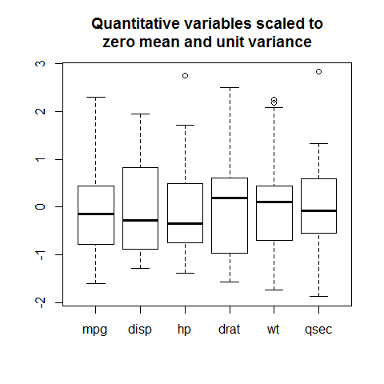
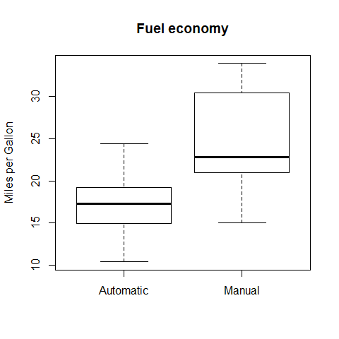
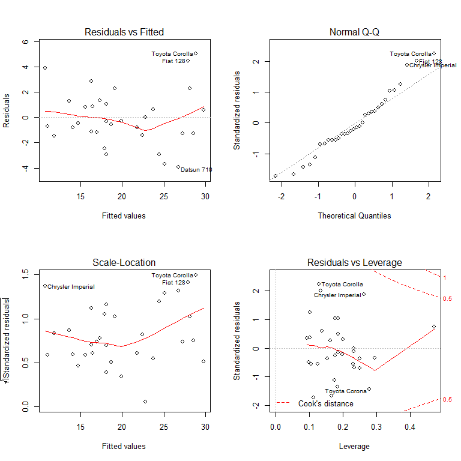

#### Is an automatic or manual transmission better for MPG?

##### Executive Summary

This is an investigation of the efficiency of manual vs automatic transmission in cars. Data from the 1974 *Motor Trend US magazine* were used to answer the questions:

1. Is an automatic or manual transmission better for Miles per Gallon (MPG)?
2. What is the difference in the MPG between automatic and manual transmissions?

It was found that cars with manual transmission was better (1.8 MPG), but the effect may be more due to other factors (smaller engine and less weight) than the transmission.

##### Data
The data was extracted from the 1974 Motor Trend US magazine, and comprises fuel consumption and 10 aspects of automobile design and performance for 32 automobiles (1973 and 74 models). Categorical variables (*cyl*, *vs*, *am*, *gear* and *carb*) were converted into factors. The transmission type variable (*am*) was given meaningful labels.


```r
data(mtcars); mtcars$cyl  <- factor(mtcars$cyl); mtcars$vs   <- factor(mtcars$vs)
mtcars$gear <- factor(mtcars$gear); mtcars$carb <- factor(mtcars$carb)
mtcars$am   <- factor(mtcars$am, labels=c("Automatic", "Manual"))
```

##### Exploratory Analysis
Figure 1 shows that the quantitative variables seems to be near symmetric and free from large outliers. Figure 2 indicates that manual transmission system is more efficient than automatic ones. There are 0 missing values.

##### Model selection
Two models were tested to predict the mpg. The first uses *am* as the solely predictor. The second model is chosen by AIC in a Stepwise Algorithm from the full set of variables.


```r
model1 <- lm(mpg~am, mtcars); model2 <- step(lm(mpg~., mtcars), trace=0)
```

##### Results
The model using the transmission type (*am*) as the solely predictor explains only 36% of the variance.

```r
summary(model1)$coef
```

```
##             Estimate Std. Error t value  Pr(>|t|)
## (Intercept)   17.147      1.125  15.247 1.134e-15
## amManual       7.245      1.764   4.106 2.850e-04
```
The model selected using the *Stepwise Algorithm* explains as much as 87% of the variance. Figure 3 shows residual and diagnostic plots. The residual seems to fulfill the normality assumption (*Q-Q plot*) and no influential outlier is indicated. (*Residuals vs Leverage*).


```r
summary(model2)$coef
```

```
##             Estimate Std. Error t value  Pr(>|t|)
## (Intercept) 33.70832    2.60489 12.9404 7.733e-13
## cyl6        -3.03134    1.40728 -2.1540 4.068e-02
## cyl8        -2.16368    2.28425 -0.9472 3.523e-01
## hp          -0.03211    0.01369 -2.3450 2.693e-02
## wt          -2.49683    0.88559 -2.8194 9.081e-03
## amManual     1.80921    1.39630  1.2957 2.065e-01
```


##### Discussions and Conclusions
The Analysis of Variance (Anova) shows that the second model is significantly better (P-value 1.7e-08) than the first model. The second model includes the number of cylinders (*cyl*), the horse power (*hp*) and the weight (*wt*) along with the transmission type (*am*). These variables seemed to be reasonable to include. The second model  explained 87% of the variance and had reasonable residuals and diagnostic plots. This all indicates that the model was accurate. 


```r
anova(model1,model2)
```

```
## Analysis of Variance Table
## 
## Model 1: mpg ~ am
## Model 2: mpg ~ cyl + hp + wt + am
##   Res.Df RSS Df Sum of Sq    F  Pr(>F)    
## 1     30 721                              
## 2     26 151  4       570 24.5 1.7e-08 ***
## ---
## Signif. codes:  0 '***' 0.001 '**' 0.01 '*' 0.05 '.' 0.1 ' ' 1
```


The *hp* and *wt* were both negative and significant with a P-value < 0.05. The model indicated that cars with manual transmission were expected to have 1.8 more mpg than those with automatic transmission, but the value was not significant (P-value > 0.05). 


```r
aggregate(wt~am,mtcars,mean)
```

```
##          am    wt
## 1 Automatic 3.769
## 2    Manual 2.411
```

```r
aggregate(hp~am,mtcars,mean)
```

```
##          am    hp
## 1 Automatic 160.3
## 2    Manual 126.8
```

Cars with manual transmission in the data set have better fuel economy than those with automatic transmission. The effect is not likely to be solely be contributed to the transmission system type since cars with manual transmission in this data set also have smaller engine and less weight. 

<div style="page-break-after: always;"></div>

##### Appendix

*Fig 1* is investigating the normality of the quantitative variables and the presence of outliers.


```r
boxplot(scale(mtcars[,sapply(mtcars,is.numeric)]), main="Quantitative variables scaled to\nzero mean and unit variance")
```



<div style="page-break-after: always;"></div>

*Fig 2* is comparing the fuel efficiency and cars with manual transmission have better mpg.


```r
boxplot(mpg~am,mtcars, main="Fuel economy", names = c("Automatic", "Manual"), ylab = "Miles per Gallon")
```



<div style="page-break-after: always;"></div>

*Fig 3* shows residual and diagnostic plots

```r
par(mfrow = c(2,2))
plot(model2)
```



